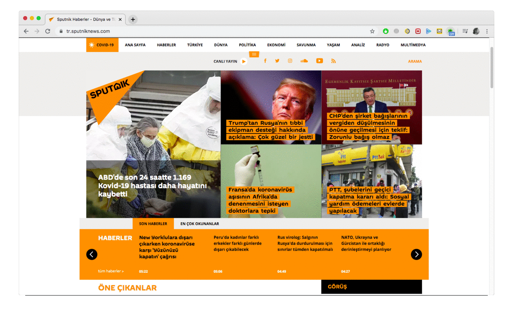

# Korona Haberleri

Bu chrome eklentisi aşağıdaki anahtar kelimeleri içeren web sitelerinden içerik kaldırır:

* "COVID"
* "korona"
* "Karanatina"
* "corona" or "virus",
* "quarantine" or "lockdown"
* "pandemic"

`content.js` nin üzerine uygun şekilde başka kelimeler de ekleyebilirsiniz.

Bazı özel durumlar, yalnızca metni kaldırmak yerine makale düzeyindeki içeriği kaldırmak için en popüler Türkçe web sitelerinin bazılarınıda ele alır.

## Install

1. Yüklemek için [this file](https://github.com/STUDIOBRN/COVIDPause.git) dosyasını indirip açın.
2. Chrome tarayıcınızı açıp `chrome://extensions/`, menüden extensions'ı seçin.
3. Sağ üst köşede, geliştirici modu aktif edin.
4. Sol üste "Load Unpacked" veya Türkçe adıyla indirdiğiniz klasörü yükleye tıklayın.
5. Dosyayı seçip yüklemeyi yapın.

## Usage

Tarayıcının sağ üzerinde yeşil bir virüs gözükecek. Engellenen kelimeleri duraklatmayı geçici olarak etkinleştirmek / devre dışı bırakmak için sağ üst taraftaki yeşil duraklat simgesini tıklayın.
